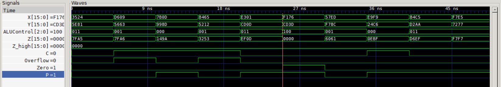
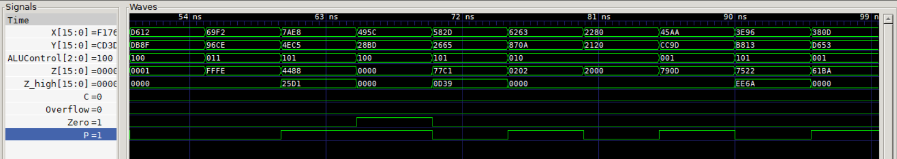
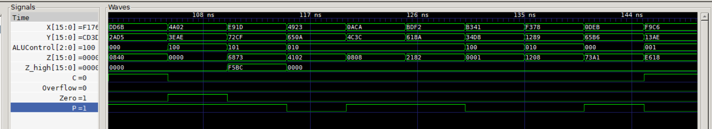

# 16-bit Parameterized ALU — Verilog Implementation

 



## Overview
A parameterized 16-bit signed Arithmetic Logic Unit (ALU)
implemented in Verilog HDL. The design supports 6 arithmetic
and logic operations and produces 4 status flag outputs.
The bit-width is parameterized (default: 16-bit) and can be
changed to any width without modifying the core logic.

## Module Interface

### Inputs
| Signal | Width             | Description           |
|------------|---------------|-----------------------|
| X          | 16-bit signed | First operand         |
| Y          | 16-bit signed | Second operand        |
| ALUControl | 3-bit         | Selects the operation |

### Outputs
| Signal | Width  | Description                                       |
|--------|------- |-------------                                      |
| Z      | 16-bit | Primary result output. Lower 16bits of MUL result |
| Z_high | 16-bit | Upper 16 bits of MUL result                       |
| C      | 1-bit  | Carry out (ADD/SUB)                               |
| Zero   | 1-bit  | High when Z = 0                                   |
| S      | 1-bit  | Sign flag — MSB of result                         |
| P      | 1-bit  | Even parity of result                             |
|Overflow| 1-bit  | Signed overflow (ADD/SUB only)                    |

## Supported Operations
| ALUControl | Operation | Expression         | Description |
|------------|-----------|--------------------|-------------|
| 3'b000     | ADD       | {C,Z} = X + Y      | Extended addition with carry |
| 3'b001     | SUB       | {C,Z} = X + (~Y+1) | Two's complement subtraction |
| 3'b010     | AND       | Z = X & Y          | Bitwise AND |
| 3'b011     | OR        | Z = X | Y          | Bitwise OR |
| 3'b100     | SLT       | Z = (X < Y) ? 1 : 0| Signed set-less-than |
| 3'b101     | MUL       | {Z_high,Z} = X * Y | Full 32-bit signed multiplication |

## Design Implementation

### How Each Operation is Implemented

**ADD:**
The carry and result are computed together using
concatenation: `{C, Z} = {1'b0, X} + {1'b0, Y}`
The extra bit on each operand captures the carry out
without overflow into the result bits.

**SUB:**
Implemented using two's complement addition:
`{C, Z} = {1'b0, X} + {1'b0, ~Y} + 1`
If carry(C)=0 borrowing has occured while if C=1 no borrow is needed

**SLT (Set Less Than):**
Uses a conditional expression to produce a width-bit
result: if X < Y, output is 1 in the LSB with all
other bits zero. The inputs are signed to get correct comparison result.

**MUL (Multiplication):**
A full 32-bit signed result is stored in an internal
`expected_mul[31:0]` register. The lower 16 bits go
to Z and the upper 16 bits go to Z_high. This correctly
handles multiplication overflow without losing data.

### Flag Implementation
All 4 flags are computed using continuous `assign`
statements outside the always block — they update
combinationally whenever Z changes:

- **Zero:** `assign Zero = ~|Z`
  The reduction NOR operator checks if all bits are 0
  in a single expression.

- **Sign:** `assign S = Z[width-1]`
  Simply reads the MSB of the result. For signed
  numbers, MSB = 1 means negative.

- **Parity:** `assign P = ~^Z`
  The reduction XNOR gives even parity — high when
  there are an even number of 1s in the result.

- **Overflow:** Detected only for ADD and SUB using
  sign bit comparison. Overflow occurs when both
  inputs have the same sign but the result has a
  different sign.

### Parameterization
The width is defined as `parameter width = 16`.
Changing this single value automatically scales
all signal widths, the SLT logic, and the MUL
output width throughout the design — no other
changes needed.

### Testbench Approach
Rather than hardcoded test vectors, the testbench
uses `$random` to generate 50 random signed 16-bit
inputs and `$urandom_range(0,5)` to randomly select
operations from 0 to 5 only. The expected output is computed
independently inside the testbench using the same
logic, then compared against the actual ALU output.
This self-checking approach catches bugs automatically
without manually verifying each output.
## How to Simulate
```bash
# Compile
iverilog -o sim.out src/alu.v testbench/alu_tb.v

# Run simulation
vvp sim.out

# View waveform
gtkwave waveform/alu_sim.vcd
```

## Tools Used
- Icarus Verilog v12 (simulation)
- GTKWave v3.3 (waveform analysis)
- VS Code + Verilog-HDL extension (development)