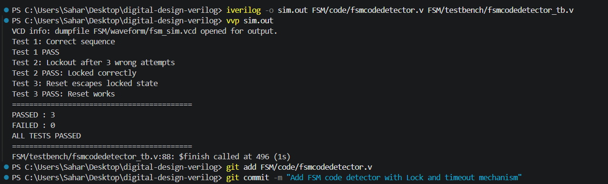

# FSM Digital Security Lock — Verilog Implementation



## Overview
A synchronous Finite State Machine implemented in Verilog
that detects a specific 5-step button sequence to grant
access. Designed with two security features: wrong attempt
lockout and automatic timeout.

## Sequence to Unlock
```
s → r → b → g → r
```
Any incorrect button press at any stage resets progress.
After 3 wrong attempts the FSM permanently locks until reset.

## State Diagram
| State | Encoding | Meaning | Correct Input | Next State |
|-------|----------|---------|---------------|------------|
| S0 | 000 | Initial / Reset | s only | S1 |
| S1 | 001 | s detected | r only | S2 |
| S2 | 010 | s→r detected | b only | S3 |
| S3 | 011 | s→r→b detected | g only | S4 |
| S4 | 100 | s→r→b→g detected | r only | S5 |
| S5 | 101 | SUCCESS | s → restart | S1 |
| LOCKED | 110 | Locked permanently | reset only | S0 |

## Module Interface
| Signal | Direction | Description |
|--------|-----------|-------------|
| clk | input | Clock signal |
| reset | input | Synchronous reset → S0 |
| s, r, g, b | input | Button inputs |
| a | output | High when any button is pressed |
| unlock | output | High when correct sequence detected |

## Design Implementation

### Architecture — 3-Block FSM
The FSM uses the professional 3-block structure:

**Block 1 — State Register (Sequential):**
Clocked always block with synchronous reset. Updates
state to next_state on every rising clock edge. Also
manages wrong_button_count and timeout_counter registers.

**Block 2 — Next State Logic (Combinational):**
`always @(*)` block computing next_state from current
state and inputs. Contains lockout and timeout overrides
at the end of the case statement.

**Block 3 — Output Logic (Registered):**
Separate sequential block — unlock goes high when
state == S5.

### Input Validation
Each state checks that EXACTLY ONE button is pressed
using conditions like `s && !r && !g && !b` preventing
false triggers from simultaneous button presses.

### Security Feature 1 — Wrong Attempt Lockout
A 3-bit `wrong_button_count` register tracks incorrect
presses. A wrong press is detected when a button is
pressed while not in S0 or Locked, but next_state
returns to S0. After 3 wrong attempts the FSM enters
the permanent LOCKED state ignoring all inputs until
synchronous reset is applied.

### Security Feature 2 — Timeout Mechanism
A 4-bit `timeout_counter` increments every clock cycle
when no button is pressed and FSM is not in S0 or
Locked. After 8 cycles of inactivity the FSM resets
to S0 automatically.

### Any-Button Flag
`assign a = s | r | g | b` provides a single wire
that is high whenever any button is pressed — used
in every state for clean reset-to-S0 logic.

## Simulation Results
```
Test 1: Correct sequence      → PASS
Test 2: Lockout after 3 wrong → PASS
Test 3: Reset escapes lockout → PASS
==========================================
PASSED : 3
FAILED : 0
ALL TESTS PASSED
==========================================
```

## How to Simulate
```bash
iverilog -o sim.out FSM/code/fsmcodedetector.v FSM/testbench/fsmcodedetector_tb.v
vvp sim.out
gtkwave FSM/waveform/fsm_sim.vcd
```

## Tools Used
- Icarus Verilog v12 (simulation)
- GTKWave v3.3 (waveform analysis)
- VS Code + Verilog-HDL extension (development)
```